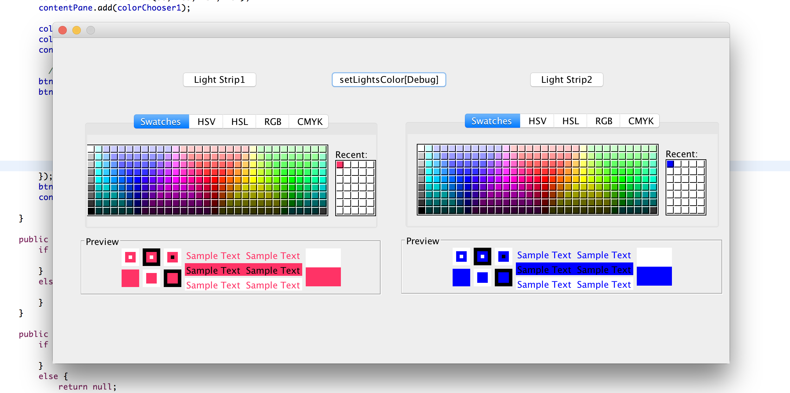
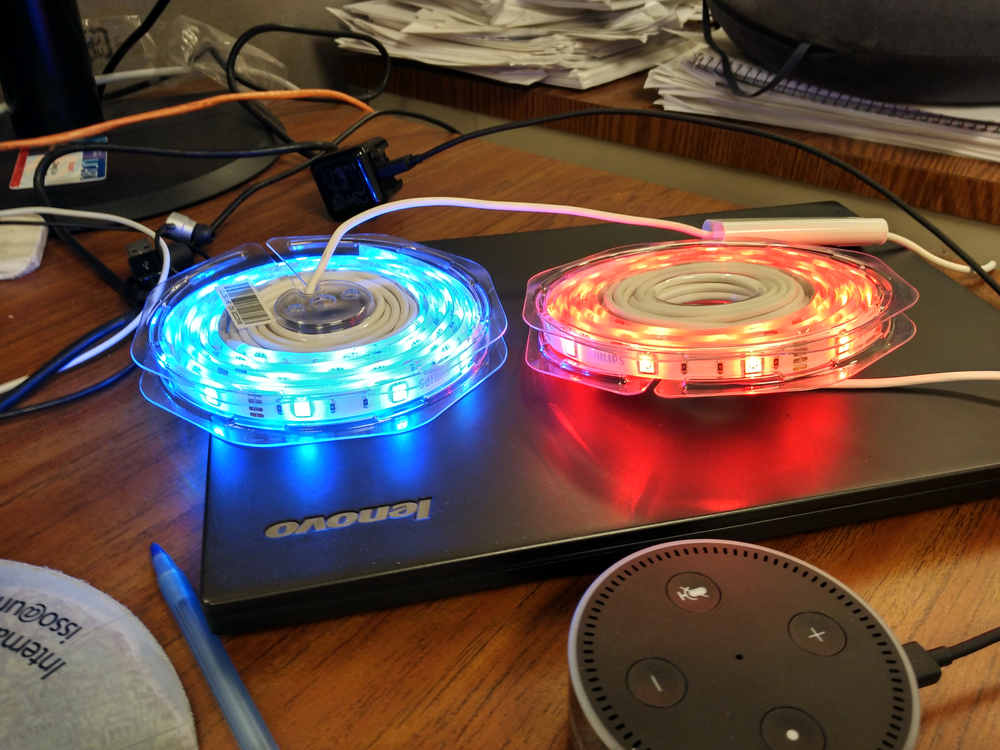

README
====

## Overview

Philips Hue(http://www2.meethue.com/en-us/), light strips or light that supports using RESTful API to control the lights, query the status, get and set state for the lights.

This repo is the JAVA implementation for using the RESTful API of Hue, this repo provides functions for:

* turn on/off lights
* set colors
* get light status
* parse the response of JSON object
* JSON parser/constructor for response
* PUT/POST/GET request for general HTTP request

It also depends on various `*.jar` like [okhttp](http://square.github.io/okhttp/), okio, moshi, json.

For RESTful API of Hue, check here: http://www.developers.meethue.com/documentation/getting-started

## Screenshot

First, open the ColorPanel as the Entry UI of the Application, it will show two color chooser for seperate control of the light strips, as this figure shows:  

Then click the `setLightColor[Debug]` button, it will read the color of the two choosers, and set the colors of the light as you selected seperately, as this figure shows 

## NOTE

Network must be correctly connected, and Hue bright/PC should be connected in the same sub-network, via one routers, here we use TP-LINK routers, the host URL is: http://192.168.1.100/

Some test functions and examples are in `test` package(test, TestDemo class), and main entry is the `UI` package, API for other modules are under `LightInterfaceAPI` package
